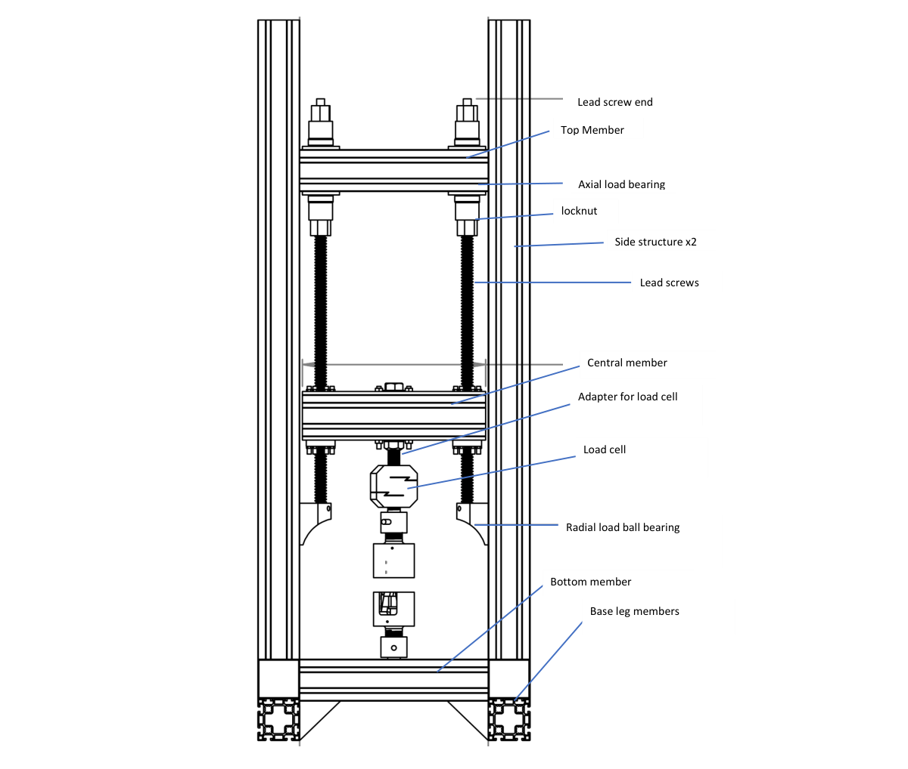
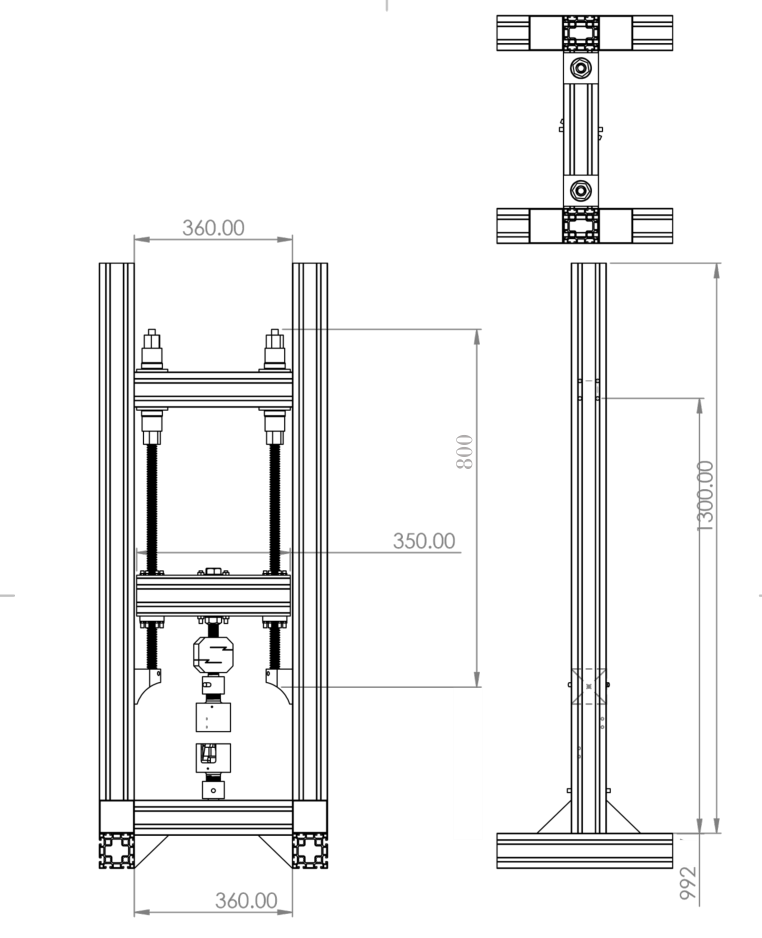

# Project Requirements

This document outlines the hardware and software requirements for the Python-based Universal Testing Machine (UTM) application.

## Hardware

*   **Universal Testing Machine (UTM):** The existing custom-built machine with:
    *   2x Nema 23 stepper motors (AMP57TH76-4280) (1.85 Nm stall torque)
    *   2x MKS TMC2160 Nema23 driver board2
    *   1x HX711 load cell amplifier
    *   1x Anyload 101BH-3t load cell (3 ton capacity)
    *   2x AS5600 magnetic encoders
    *   1x ESP32 LolinD32 Board
    *   [Aluminium extrusions](https://www.alucon.se/product/aluminiumprofil-80x80-basic-t-spar-8-1-mm)
    *   2x EPL-Q64 i20
    *   2x Tr 22x5  TH22 Trapezoidal lead screws
    *   4x SKF-6005-2z Deep groove ball bearings
*   **Camera:**
    *   **Model:** Basler acA2440-35um
    *   **Interface:** USB 3.0
*   **Lens:**
    *   **Model:** Azure-2514M
    *   **Focal Length:** 25mm
    *   **Max Resolution:** 5MP
    *   **Sensor Format:** 2/3"
*   **Lighting:** LED lights for illuminating the test specimen.




## Software

### Core Libraries

*   **GUI Framework:** PyQt6
*   **Serial Communication:** `pyserial` for communicating with the Arduino microcontroller.
*   **Camera Integration:** A Python wrapper for the Basler Pylon SDK will be needed. The `pypylon` library is the standard for this.
*   **Numerical Computing:** `numpy` for handling numerical data and calculations.
*   **Plotting:** `pyqtgraph` or `matplotlib` for real-time data plotting within the PyQt6 application. `pyqtgraph` is generally recommended for high-performance real-time plotting in PyQt.
*   **Data Storage:** `pandas` and `h5py` (for HDF5) or a similar library for saving data.

### Digital Image Correlation (DIC)

*   **1D Two-Point Tracking:** The primary goal for DIC is to track two points on the specimen to measure strain.
*   **Image Processing:** `OpenCV-Python` (`opencv-python`) will be used for image manipulation, feature detection, and tracking.
*   **Algorithm:**
    1.  The user will select two points of interest (e.g., by clicking on the camera feed).
    2.  A feature detection algorithm (e.g., Shi-Tomasi corner detection or a simple blob detector) will be used to identify features within a small region of interest (ROI) around the selected points.
    3.  An optical flow algorithm (e.g., Lucas-Kanade) will be used to track these features from frame to frame.
    4.  The distance between the tracked points will be calculated in each frame to determine the elongation and, subsequently, the strain.

## Installation of Dependencies

The following commands will be needed to install the required Python packages:

```bash
pip install PyQt6
pip install pyserial
pip install numpy
pip install pyqtgraph
pip install pandas
pip install h5py
pip install opencv-python
pip install pypylon
```

**Note on `pypylon`:** The `pypylon` library requires the Basler Pylon SDK to be installed on the system. The user has indicated that the Basler Pylon 25.11.0 drivers are already installed.
