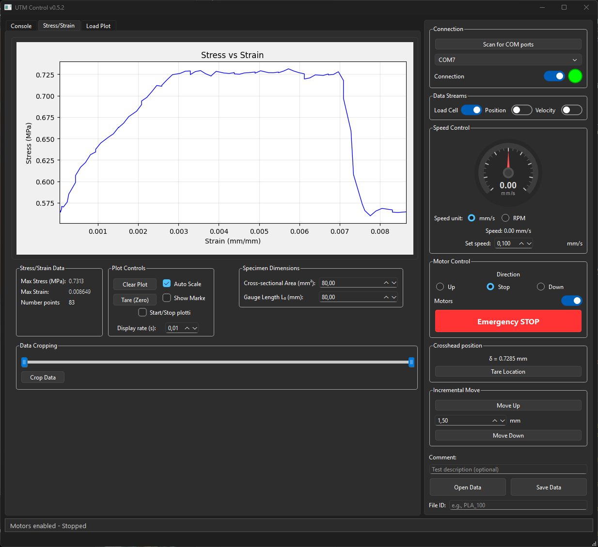

# Universal Testing Machine

Based on the work done by [Stefan from CNC kitchen](https://www.youtube.com/watch?v=uvn-J8CbtzM) and the students [Stephen Jose Mathew and Vijay Francis](https://hj.diva-portal.org/smash/get/diva2:1472019/FULLTEXT01.pdf) this is the continuation of that work. The machine is used at the Jönköping University - School of Engineering for teaching various mechanical engineering courses and the design, verification and validation of tensile testing equipment is in focus.

## Firmware

The firmware is is based on the HX711 amplifier, uses 10Hz polling rate and the TMC2160 driver on two MKS TMC2160_57 board, each driving a AMP57TH76-4280 Nema 23 stepper motor. The motors are geared down 20 times using EPL64/2 planetary gears. 

Rob Tillarts HX711 library is used to read raw values at 10Hz non-blocking (when data is available).

For drving the motors, one controll signal is sent to both drivers using the MobaTools library.

Additionally on each motor shaft end a magnet is attached and its rotational position contactlessly measured by a AS5600 magnetic encoder using Rob Tillats library. This is used to measure the rotational speed of the motors as well as getting the total amount of rotation.

## Software

The software is written in python using the PyQt6 framework for the GUI.



## Hardware

### Mechanics BOM

| Qty | Component | Description |
|-----|-----------|-------------|
| 1 | [Aluminium Profile 80x80](https://www.alucon.se/product/aluminiumprofil-80x80-basic-t-spar-8-1-mm) | Frame extrusions |
| 2 | EPL-Q64 i20 | Planetary gearboxes (20:1 reduction) |
| 2 | Tr 22x5 TH22 | Trapezoidal lead screws (5mm pitch) |
| 4 | SKF-6005-2Z | Deep groove ball bearings |

### Electronics BOM

| Qty | Component | Description |
|-----|-----------|-------------|
| 2 | Nema 23 AMP57TH76-4280 | Stepper motors (1.85 Nm stall torque) |
| 2 | MKS TMC2160_57 | Stepper driver boards |
| 1 | ESP32 Lolin D32 | Microcontroller |
| 1 | HX711 | Load cell amplifier |
| 1 | Anyload 101BH-3t | Load cell (3 ton capacity) |
| 2 | AS5600 | Magnetic rotary encoders |

### Camera System (for DIC)

| Qty | Component | Specification |
|-----|-----------|---------------|
| 1 | Basler acA2440-35um | USB 3.0 camera |
| 1 | Azure-2514M | 25mm lens, 5MP, 2/3" sensor |
| - | LED lights | Specimen illumination |

## Digital Image Correlation

Two spray-painted markers on the specimen gauge are tracked in every camera frame. Their pixel
separation `L_px` against the frozen reference `Px₀` gives engineering strain directly on the
specimen, so the measurement carries no machine compliance and no grip slip.

### Hardware

Basler acA2440-35um over USB 3.0, 25 mm lens, LED illumination. The camera is mounted with the
specimen across the sensor, so every frame is rotated 90° before detection — the loading axis is
the *rotated* frame's Y.

### Software

`camera_manager.py` thresholds each frame, finds the two markers, and emits strain.
`utm_analysis.py` turns a saved CSV into E, σ_y, UTS, ε_f, toughness and the anchor. That module and
its siblings are deliberately **stdlib-only**, so results can be recomputed on any machine with no
camera stack installed.

---

# Getting started

```bash
git clone https://github.com/AdithyaSivakumar-3/UTM.git
cd UTM
python -m venv .venv && .venv\Scripts\activate      # Windows
pip install -r requirements.txt
python "Software/UTM_PyQt6/main.py"
```

Developed on **Python 3.14** and Windows. `requirements.txt` is grouped by what you want to do —
read the comments before installing everything.

**You do not need the rig to work on this.** `pypylon` is the only hardware-specific dependency;
skip it and every offline path still runs. Without a camera the app starts but cannot track.

## Where to look first

| File | What it is |
|---|---|
| `Software/UTM_PyQt6/docs/ROADMAP.md` | **Start here.** Living status of every feature: done, planned, blocked, and what needs rig time. |
| `Software/UTM_PyQt6/main.py` | The application. Control loop, live plots, CSV export, all UI. |
| `Software/UTM_PyQt6/camera_manager.py` | Camera, thresholding, marker detection, strain. |
| `Software/UTM_PyQt6/utm_analysis.py` | The canonical analyser. Every script and the app share it — do not re-implement it. |
| `Software/UTM_PyQt6/registry.json` | The specimen register: every test, with its computed properties. |
| `Software/UTM_PyQt6/dic_replay.py` | Replays a saved capture through the real detector and explains why tracking failed. |
| `documentation/` | Slide-deck and poster generators. Each rebuilds from data, never from typed-in numbers. |

## What is NOT in this repository

**The test data.** `Software/UTM_PyQt6/8.6.20 - Tensile test to Failure/` is gitignored — it is
several GB of CSVs, camera frames and videos. `registry.json` references those paths, so analysis
and deck scripts will not find their inputs on a fresh clone. Ask for the data folder separately
if you need to reproduce a result rather than write new code.

Also excluded: captured frames and videos, generated reports, and `Validation docs/`.

## Conventions worth knowing before you change anything

- **Engineering stress and strain** throughout. Force ÷ *original* area; ΔL/L₀. The CSV also carries
  a true-strain column, kept only so old files still parse.
- **Px₀ is frozen AFTER the preload**, so the strain axis starts at a seated specimen. It has
  exactly one owner — the Calibrate Px₀ button. Nothing else may move it.
- **Elastic modulus is the steepest straight run**, chosen per specimen, not a fixed strain window.
  `analyze()` also returns `E_fixed` so older numbers remain reproducible.
- **Fracture is detected on load collapse.** A DIC jump alone is not enough — it misfires on
  ductile material and on a lost marker.
- Force is tared at the preload, so an unloaded or fractured specimen reads *negative*.
