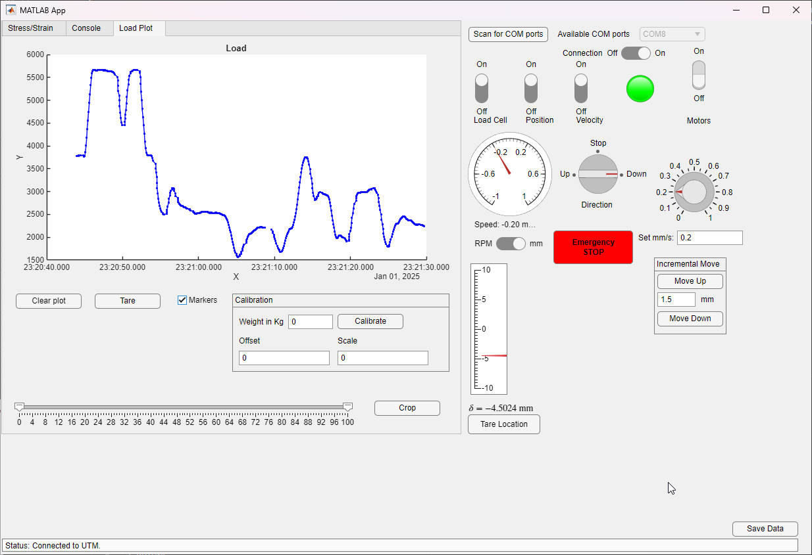

# Universal Testing Machine

Based on the work done by [Stefan from CNC kitchen](https://www.youtube.com/watch?v=uvn-J8CbtzM) and the students [Stephen Jose Mathew and Vijay Francis](https://hj.diva-portal.org/smash/get/diva2:1472019/FULLTEXT01.pdf) this is the continuation of that work. The machine is used at the Jönköping University - School of Engineering for teaching various mechanical engineering courses and the design, verification and validation of tensile testing equipment is in focus.

## Firmware

The firmware is is based on the HX711 amplifier, uses 10Hz polling rate and the TMC2160 driver on two MKS TMC2160_57 board, each driving a AMP57TH76-4280 Nema 23 stepper motor. The motors are geared down 20 times using EPL64/2 planetary gears. 

Rob Tillarts HX711 library is used to read raw values at 10Hz non-blocking (when data is available).

For drving the motors, one controll signal is sent to both drivers using the MobaTools library.

Additionally on each motor shaft end a magnet is attached and its rotational position contactlessly measured by a AS5600 magnetic encoder using Rob Tillats library. This is used to measure the rotational speed of the motors as well as getting the total amount of rotation.

## Software

The software is written in python using the PyQt6 framework for the GUI.

## Hardware

### Mechanics BOM

| Qty | Component | Description |
|-----|-----------|-------------|
| 1 | [Aluminium Profile 80x80](https://www.alucon.se/product/aluminiumprofil-80x80-basic-t-spar-8-1-mm) | Frame extrusions |
| 2 | EPL-Q64 i20 | Planetary gearboxes (20:1 reduction) |
| 2 | Tr 22x5 TH22 | Trapezoidal lead screws (5mm pitch) |
| 4 | SKF-6005-2Z | Deep groove ball bearings |

### Electronics BOM

| Qty | Component | Description |
|-----|-----------|-------------|
| 2 | Nema 23 AMP57TH76-4280 | Stepper motors (1.85 Nm stall torque) |
| 2 | MKS TMC2160_57 | Stepper driver boards |
| 1 | ESP32 Lolin D32 | Microcontroller |
| 1 | HX711 | Load cell amplifier |
| 1 | Anyload 101BH-3t | Load cell (3 ton capacity) |
| 2 | AS5600 | Magnetic rotary encoders |

### Camera System (for DIC)

| Qty | Component | Specification |
|-----|-----------|---------------|
| 1 | Basler acA2440-35um | USB 3.0 camera |
| 1 | Azure-2514M | 25mm lens, 5MP, 2/3" sensor |
| - | LED lights | Specimen illumination |

## Digital Image Correlation

### Hardware

### Software
